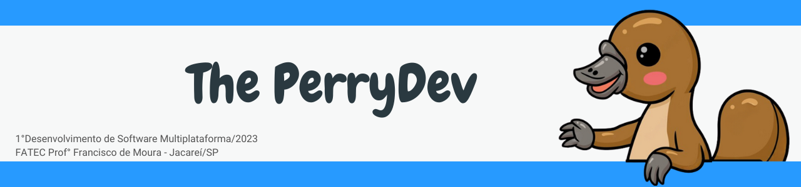

 

 

    <a href="#sobre">Sobre</a>  |  
    <a href="#backlogs">Backlogs</a>  |  
    <a href="#user-stories">User Stories</a>  |  
    <a href="#prototipo">Protótipo</a>  |  
    <a href="#tecnologias">Tecnologias</a>  |  
    <a href="#equipe">Equipe</a>  |  
    <a href="#final">Apresentação Final</a>

   

## :bookmark_tabs: Sobre o projeto

A partir da apresentação do desafio pela empresa FATEC, a solução apresentada pela empresa The Perry Devs consiste em criar um site institucional para treinamento da metodologia ágil e seus artefatos, fazendo com que os colaboradores da FATEC padronizem a elaboração de seus projetos e multipliquem a metodologia após o aprendizado.

> _Projeto baseado na metodologia ágil SCRUM, procurando desenvolver a Proatividade, Autonomia, Colaboração e Entrega de Resultados dos envolvidos_

:pushpin: Status do Projeto: **Em Andamento** :on:

### Entregas de Sprints

Cada entrega será realizada a partir da criação de uma **tag** em cada repositório (Doc, Web e API), assim como a criação de branchs específicas para cada Sprint a fim de controlar cada etapa do projeto. Observe a relação a seguir:
| Sprint | Previsão | Status | Histórico |
|:------:|:----------:|:-------------|:-------------------------------------------------:|
| 01 | De 13/03/23 a 09/04/23 | :clock2: Em andamento | [ver relatório](https://github.com/ThePerryDev/docs/tree/sprint-01)|
| 02 | De 13/04/23 a 07/05/23 | :soon: Não Iniciado | [ver relatório]|
| 03 | De 15/05/23 a 06/06/23 | :soon: Não Iniciado | [ver relatório]|

→ [Voltar ao topo](#topo)

## :dart: Backlog 

 

 

 

→ [Voltar ao topo](#topo)

## :mag: User Stories

 

→ [Voltar ao topo](#topo)

## :repeat_one: Protótipo 

Conforme previamente planejado, nesta etapa do projeto foram desenvolvidos wireframes para a concepção do layout. Para isso, utilizamos diversas ferramentas, incluindo o ColorSpace e a Paleta de Cores Online para definir as cores ideais a serem utilizadas. Além disso, utilizamos o Figma para a criação de protótipos de interfaces gráficas, mas ainda sem a adição de funcionalidades reais, apenas com foco no aspecto visual. Assim ficou o resultado:

 

→ [Voltar ao topo](#topo)

## :pager: Tecnologias

Para a construção do nosso projeto, utilizamos uma variedade de linguagens, ferramentas, tecnologias e bibliotecas. Cada uma dessas escolhas foi cuidadosamente considerada para garantir a melhor implementação e atender aos requisitos do projeto. Abaixo, apresentamos as utilizadas na construção do projeto.

 

→ [Voltar ao topo](#topo)

## :busts_in_silhouette: Equipe

|    Função     | Nome                                  |                                                                                                                                                      LinkedIn & GitHub                                                                                                                                                      |
| :-----------: | :------------------------------------ | :-------------------------------------------------------------------------------------------------------------------------------------------------------------------------------------------------------------------------------------------------------------------------------------------------------------------------: |
| Product Owner | Daniel Dornelas                     |            |
| Scrum Master  | João Vitor |             |
|   Dev Team    | Aloisio Garkauskas                       |                    |
|   Dev Team    | Bianca Lucas da Silva Caçula                |       |
|   Dev Team    | Bruno Mendes Carvalho de Paula       |                        |
|   Dev Team    | Heclair José           |                     |
|   Dev Team    | Luís Eduardo       |                 |
|   Dev Team    | Mariana Ramalho              |   |
|   Dev Team    | Rafael Estevam               |   |
|   Dev Team    | Willian Garcia               |   |

→ [Voltar ao topo](#topo)

## :dart: Apresentação Final do Projeto

 
