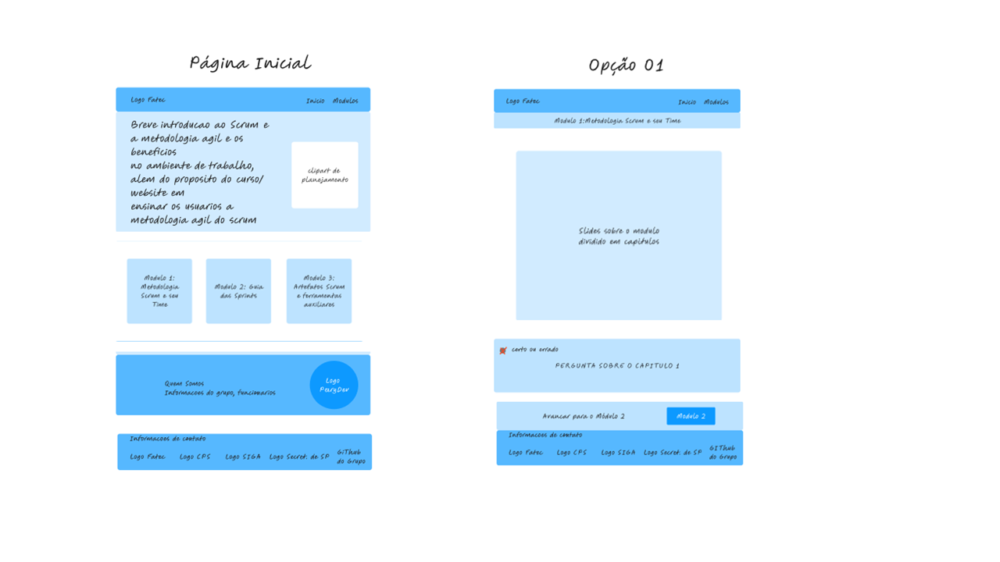
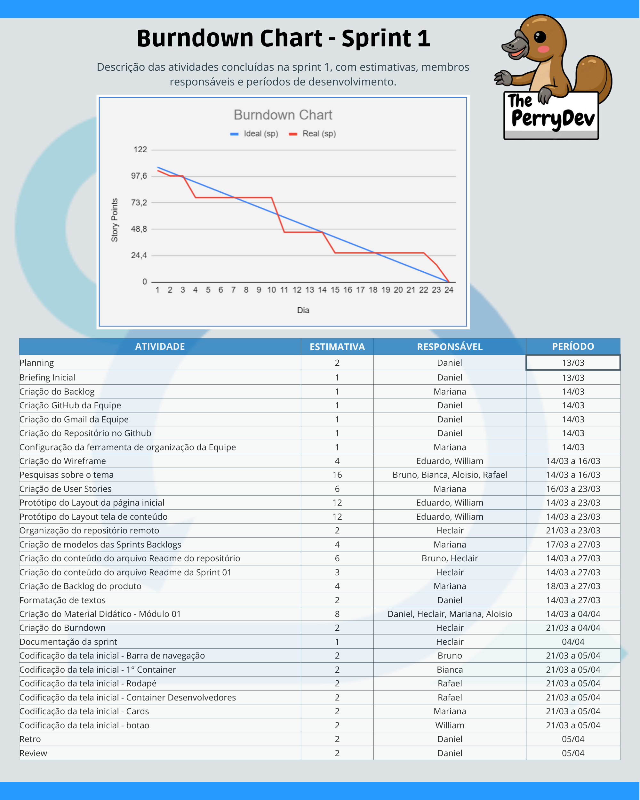

<h1 align="center">Sprint 1: 13/03/2023 a 09/04/2023</h1>

    <a href="#objetivos">Objetivos da sprint</a> &nbsp |&nbsp &nbsp
    <a href="#entregas">Entregas</a> &nbsp |&nbsp &nbsp
    <a href="#prototipo">Demonstração</a> &nbsp |&nbsp &nbsp 
    <a href="#metricas">Métricas do time</a> &nbsp |&nbsp &nbsp
    <a href="#links">Links úteis</a>

O projeto foi contituído com base na construção de um site capaz de ensinar de maneira didática a metodologia scrum e seus artefatos, onde permita que o usuário por meio do website absorva o conhecimento lá exposto por meio de um carousel elaborado com auxílio do framework bootstrap. Com base nessa estruturação a sprint um consistiu em horas voltadas para o levantamento de dados com o cliente, pesquisas bibliográficas, elaboração de conteúdo didádico, desenvolvimento do wireframe conforme a marca do cliente e codificação da tela inicial do protótipo para validação do cliente.

    
## :dart: Objetivos da Sprint
Os requisitos (tanto do cliente como da instituição de ensino) abrangidos por essa sprint são:
- RF 01: Levantamento de dados
- RF 02: Pesquisa bibliográfica
- RF 03: Desenvolvimento do material didático
- RF 04: Desenvolvimento de wireframe e protótipo

        
## :heavy_check_mark: Entregas

### Levantamento de requisitos

O P.O. manteve a comunicação com o cliente visando entender o desejo e necessidades para o produto em desenvolvimento, levando o wireframe para validação e construindo em cima deles User Stories e classificando-os em requisitos funcionais e não funcionais (tabelas todas se encontram no tópico **Backlogs** do readme principal deste repositório, ou por meio [deste link](https://github.com/ThePerryDev/docs/tree/main)) Além da organização dos requisitos em cada sprint, gerando o Sprint Backlog.

### Elaboração do wireframe(identidade visual e design do sistema)

Como proposta para solucionar o desafio apresentado e elaborar uma plataforma de treinamento para os colaboradores do cliente onde eles possam aprender e posteriormente dissemirnar o conhecimento do scrum, a plataforma foi construída com base nos tons azul, branco e cinza para atender o padrão da marca Fatec, utilizando a fonte "roboto", onde a plataforma fica com uma aparência mais atualizada e semelhante as plataformas de curso online, além da padronização entre as telas 01 e 02.

→ [Voltar ao topo](#topo)

    
## :desktop_computer: Desenvolvimento do protótipo
Validado o wireframe com o cliente, iniciou-se o trabalho de desenvolvimento do protótipo na plataforma figma onde era possível permitir ao usuário compreender a interação que o site irá possuir entre as telas e formato com que o curso será apresentado.
    

    
Com este protótipo finalizamos os requisitos RF01 e RF04 propostos para esta sprint.

#### RF 02: Pesquisa Bibliográfica

Para este requisito o time pretende entregar junto com a documentação do projeto toda a base teórica pesquisada para elaboração do material apresentado em curso de forma que fique para a Fatec uma apostila para uso dos colaboradores em seus estudos.

#### RF 03: Desenvolvimento do Material Didático

Neste requisito a equipe seguiu com o desenvolvimento do material que será apresentado ao aluno em formato power point de forma visual com imagens e textos para explicação dos artefatos.

#### Tecnologias escolhidas

A entrega da primeira sprint foi desenvolvida utilizando-se as seguintes tecnologias:

- **HTML:** linguagem de marcação para criação de páginas web;
- **CSS:** linguagem de estilização (aplicação de estilo à páginas web);
- **Figma:** site para criação do wireframe e prototipagem;
- **Word:** utilizado para criação do conteúdo bibliográfico;
- **PowerPoint:** aplicação utilizada para criação do material didático apresentado no site;
    
→ [Voltar ao topo](#topo)
    

    
## :chart_with_upwards_trend: Métricas do time
Em prol de um melhor aproveitamento das habilidades de cada integrante, o time foi separado em duas frentes: frontend e backend, onde, na primeira sprint, o time de frontend ficou responsável pela confecção do protótipo e o time de backend pelas pesquisas e testes com as tecnologias sugeridas pela empresa para a criação da API e consumo das imagens nos repositórios em nuvem. O acompanhamento de atividades, de responsabilidade da Scrum Master, se encontra na imagem adiante, que contém o gráfico Burndown gerado pela equipe (onde o eixo X são os dias trabalhados na sprint e os valores do eixo Y representam as entregas e esforços realizados com o passar do tempo), incluindo as atividades desenvolvidas e seus responsáveis.

   <!--> 

    
→ [Voltar ao topo](#topo)
    

    
## :link: Links úteis

- Site do protótipo: [https://polaris-fatec.netlify.app/](https://polaris-fatec.netlify.app/)
- Documentação em PDF, estilo monografia (que se enquadra como um requisito não funcional do projeto): [clique aqui](./documentacao.pdf)
- Repositório do site, onde estão seus códigos: [clique aqui](https://github.com/Equipe-Polaris-DSM-2021/web)
- Tags geradas em cada repositório que simbolizam o fim da 1ª sprint: [API](https://github.com/Equipe-Polaris-DSM-2021/api/releases/tag/sprint-01), [Portal Web](https://github.com/Equipe-Polaris-DSM-2021/web/releases/tag/sprint-01)
