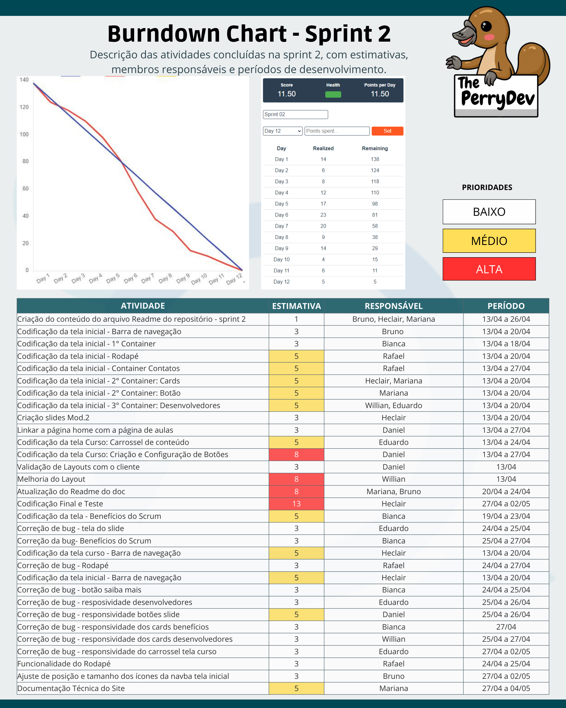

<h1 align="center">Sprint 2: 13/04/2023 a 07/05/2023</h1>

    <a href="#objetivos">Objetivos da sprint</a> &nbsp |&nbsp &nbsp
    <a href="#entregas">Entregas</a> &nbsp |&nbsp &nbsp
    <a href="#metricas">Métricas do time</a> &nbsp |&nbsp &nbsp

O projeto foi constituído com base na construção de um site capaz de ensinar de maneira didática a metodologia scrum e seus artefatos, onde permita que o usuário por meio do website absorva o conhecimento lá exposto por meio de um carrossel elaborado com auxílio do framework bootstrap. Com base nessa estruturação a sprint dois consistiu em horas voltadas para o desenvolvimento web de toda estrutura do site, sendo ela a tela inicial e tela de exibição do conteúdo do curso.

    
## :dart: Objetivos da Sprint
Os requisitos (tanto do cliente como da instituição de ensino) abrangidos por essa sprint são:

- RF 01: Desenvolvimento do material didático
- RF 03: Desenvolvimento do sistema web

        
## :heavy_check_mark: Entregas

### RF 01: Desenvolvimento do Material Didático Módulo 02

Neste requisito a equipe seguiu com o desenvolvimento do material que será apresentado ao aluno em formato power point de forma visual com imagens e textos para treinamento da metodologia scrum.

### RF 03: Desenvolvimento do Sistema Web

Neste requisito a equipe tem como meta entregar como incremento todo o site em capacidade funcional para validação do cliente conforme o protótipo validado no início da sprint 02.

→ [Voltar ao topo](#topo)

## :chart_with_upwards_trend: Métricas do time
Em prol de um melhor aproveitamento do tempo disponível durante a segunda sprint, o time se dividiu em atividades como: codificação das funcionalidades da tela inicial e codificação das funcionalidades da tela de contéudo do curso conforme protótipo validado.
    

    
→ [Voltar ao topo](#topo)
